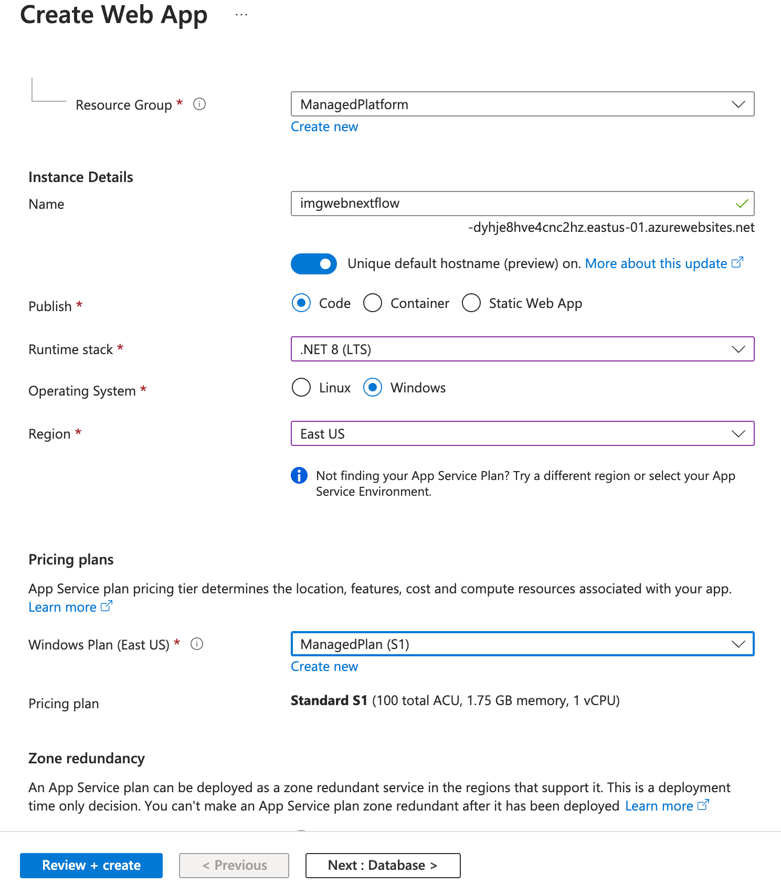

# Lab 01: Build a web application on Azure platform 

## Microsoft Azure user interface

Given the dynamic nature of Microsoft cloud tools, you might experience Azure UI changes that occur after the development of this training content. As a result, the lab instructions and lab steps might not align correctly.

Microsoft updates this training course when the community alerts us to needed changes. However, cloud updates occur frequently, so you might encounter UI changes before this training content updates. **If this occurs, adapt to the changes, and then work through them in the labs as needed.**

## Instructions

### Before you start

#### Sign in to the lab environment

Sign in to your Azure portal using the credentials provided.

> **Note**: Your lab host will provide instructions to connect to the virtual lab environment.


#### Task 1: Open the Azure portal

1. On the taskbar, select the **Microsoft Edge** icon.

2. In the browser window, browse to the Azure portal at `https://portal.azure.com`, and then sign in with the account you'll be using for this lab.

   > **Note**: If this is your first time signing in to the Azure portal, you'll be offered a tour of the portal. If you prefer to skip the tour, select **Maybe later** to begin using the portal.

   
### Exercise 1: Build a front-end web application by using Azure Web Apps
   
   #### Task 1: Test the Web API

   1. In the Microsoft Edge's browser window, open the new tab, then navigate to the URL `https://imgapi-nextflow-eyh5a5fmgmavd9as.eastus-01.azurewebsites.net/`.
   2. Examine the API's response. The API should return a JSON response that contains a list of images. (Only one in this case)

   #### Task 2: Create a web app
   
   3.  On the Azure portal's **navigation** pane, select **Create a resource**.
   
   4.  On the **Create a resource** blade, in the **Search services and marketplace** text box, enter **Web App**, and then select Enter.
   
   5.  On the **Marketplace** search results blade, select **Web App**.
   
   6.  On the **Web App** blade, select **Create**.
   
   7.  On the **Create Web App** blade, on the **Basics** tab, perform the following actions, and then select the **Monitoring** tab:
   
   | Setting                            | Action                        |
   | ---------------------------------- | ----------------------------- |
   | **Subscription** drop-down list    | Retain the default value      |
   | **Resource group** section         | Select **Create new**, enter **_[yourname]_ManagedPlatform**, and then select **OK**  **(Noted this name)**  |
   | **Name** text box                  | Enter **imgweb**_[yourname]_ **(Noted this name)** |
   | **Publish** section                | Select **Code**               |
   | **Runtime stack** drop-down list   | Select **.NET 8 (LTS)**       |
   | **Operating System** section       | Select **Windows**            |
   | **Region** drop-down list          | Select the **East US** region |
   | **Windows Plan (East US)** section | Select **Create new**, enter the value **ManagedPlan** in the **Name** text box, and then select **OK** |
   | **Pricing plan** section           | Select **Standard S1**  |
   
   The following screenshot displays the configured settings on the **Create web app** blade.
   
   
   
   8.  On the **Monitoring** tab, in the **Enable Application Insights** section, select **No**, and then select **Review + create**.
   
   9.  From the **Review + create** tab, review the options that you selected during the previous steps.
   
   10. Select **Create** to create the web app by using your specified configuration.
   
   > **Note**: Wait for the creation task to complete before you continue with this lab.
   
   11. On the **Overview** blade, select the **Go to resource** button to navigate to the blade of the newly created web app.
   
   #### Task 2: Configure a web app
   
   12. On the **App Service** blade, in the **Settings** section, select the **Environment variables** link.
   
   13. In the **Environment variables** section, perform the following actions, select **Save**, and then select **Continue**:
   
       | Setting | Action |
       |--|--|
       | **App settings** tab | Select **New application setting** |
       | **Add/Edit application setting** pop-up dialog | In the **Name** text box, enter **ApiUrl** |
       | **Value** text box | Enter the web app URL `https://imgapi-nextflow-eyh5a5fmgmavd9as.eastus-01.azurewebsites.net/` |
       | **Deployment slot setting** check box | Retain the default value, and then select **OK** |
       | Click **Save** in the  top menu | This will save the configuration value you just entered |
   
   > **Note**: Wait for the application settings to save before you continue with this lab.
   
   #### Task 3: Deploy an `ASP.NET` web application to Web Apps
   
   14. On the taskbar, select the **Visual Studio Code** icon.
   
   15. On the **File** menu, select **Open Folder**.
   
   16. In the **File Explorer** window, browse to **[Local repository directory]\\Allfiles\\Labs\\01\\Starter\\Web**, and then select **Select Folder**.
   
> **Note**: Ignore any prompts to add required assets to build and debug and to run the restore command to address unresolved dependencies.
   
   17. On the **Explorer** pane of the **Visual Studio Code** window, expand the **Pages** folder, and then select the **Index.cshtml.cs** file to open the file in the editor.
   
   18. In the editor, in the **IndexModel** class on line 30, observe the **OnGetAsync** method and the code used to retrieve the list of images from the API.
   
   19. In the **IndexModel** class on line 41, observe the **OnPostAsync** method and the code used to stream an uploaded image to the backend API.
   
   20. On the taskbar, select the **Terminal** icon.
   
   21. At the open terminal, enter the following command, and then select Enter to sign in to the Azure CLI:
   
   ```
   az login
   ```
   
   22. In the **Microsoft Edge** browser window, enter the email address and password for your Microsoft account, and then select **Sign in**.
   
   23. Return to the currently open **Terminal** window. Wait for the sign-in process to finish.
   
   24. Within the Visual Studio Code, Right-click on the **[Local repository directory]\\Allfiles\\Labs\\01\\Starter\\Web** 

   25. Select "Open in integrated terminal" to change the current directory to the **[Local repository directory]\\Allfiles\\Labs\\01\\Starter\\Web** directory that contains the lab files.
   
   26. Enter the following command, and then select Enter to deploy the **web.zip** file to the web app that you created previously in this lab:
   
   ```
   az webapp deploy --resource-group <your-resource-group-name> --src-path web.zip --type zip --name  <name-of-your-api-app>
   ```
   
   > **Note**: Replace the *\<name-of-your-web-app\>* placeholder with the name of the web app and *\<your-resource-group-name\>* that you created previously in this lab. You recently noted this app’s name in the previous steps.
   
   Wait for the deployment to complete before you continue with this lab.
   
   27. On the Azure portal's **navigation** pane, select **Resource groups**.
   
   28. On the **Resource groups** blade, select the **_[yourname]_ManagedPlatform** resource group that you created previously in this lab.
   
   29. On the **ManagedPlatform** blade, select the **imgweb**_[yourname]_ web app that you created previously in this lab.
   
   30. On the **App Service** blade, select **Browse**.
   
   31. Observe the list of images in the gallery. The gallery should list a single image that was uploaded to Storage previously in the lab.
   
   32. In the **Contoso Photo Gallery** webpage, in the **Upload a new image** section, perform the following actions:
   
       1. Select **Browse**.

       2. In the **File Explorer** window, browse to **[Local repository directory]\\Allfiles\\Labs\\01\\Starter\\Images**, select the **banhmi.jpg** file, and then select **Open**.

       3. Select **Upload**.
   
   33. Observe that the list of gallery images has updated with your new image.
   
> **Note**: In some rare cases, you might need to refresh your browser window to retrieve the new image.
   
   34. Return to the browser window that contains the Azure portal.
   
   35. Close the currently running Visual Studio Code and Terminal applications.
   

### Remove the resources group

1. In the Azure portal, use the **Search resources, services, and docs** text box to search for **Resource groups**, and then in the list of results, select **_[yourname]_ManagedPlatform**.
2. On the **_[yourname]_ManagedPlatform** blade, select **Delete resource group**.
3. In the **Delete resource group** blade, enter the name of the resource group to confirm that you want to delete the resource group, and then select **Delete**.

## Review

In this exercise, you created an Azure web app and deployed an existing web application’s code to the resource in the cloud.