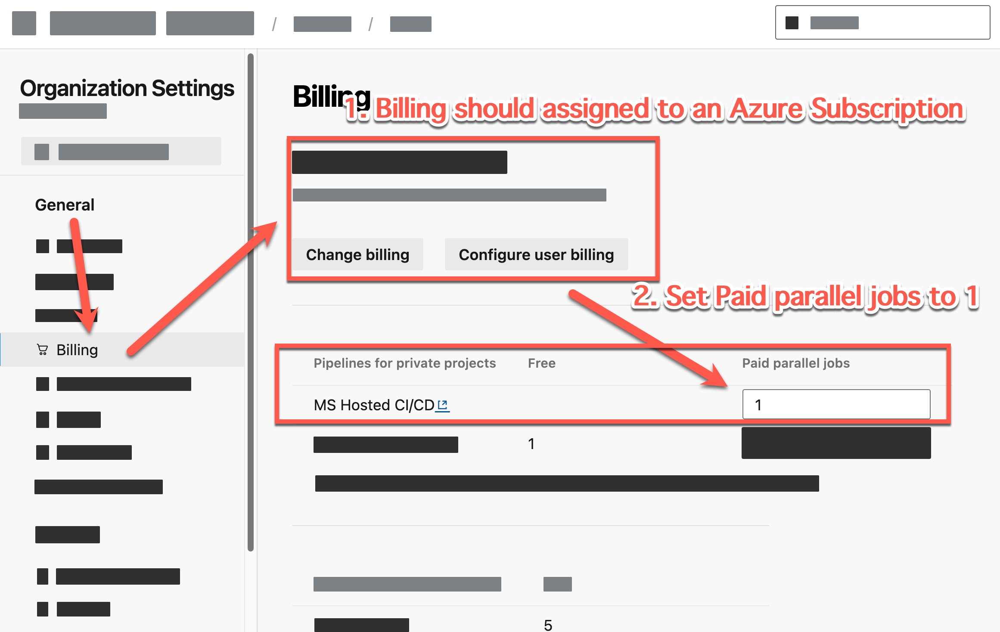
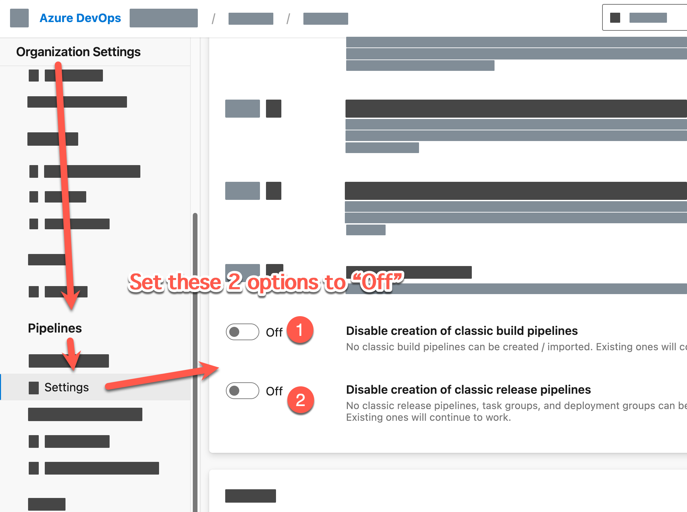
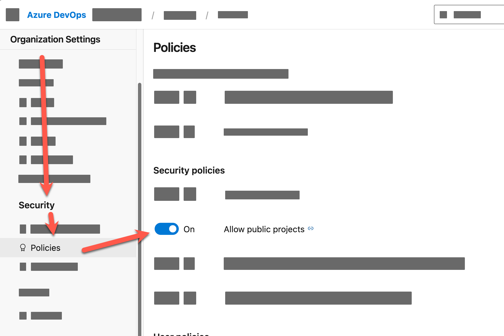

# Guideline to prepare hosting the workshop


## 1. Installed Application 

Each student machine should have the following applications installed:

1. Microsoft Edge
2. File Explorer | Finder (MacOS)
3. Terminal (Command Prompt or PowerShell)
4. [Visual Studio Code](https://code.visualstudio.com/)
5. [.NET 8 SDK](https://dotnet.microsoft.com/en-us/download/dotnet/8.0)
7. Azure CLI ([Download for Windows](https://learn.microsoft.com/en-us/cli/azure/install-azure-cli-windows?tabs=azure-cli#install-or-update) | [Install for MacOS (with Homebrew)](https://learn.microsoft.com/en-us/cli/azure/install-azure-cli-macos))
8. Git Client ([Download for Windows](https://git-scm.com/download/win) | [Install for MacOS](https://git-scm.com/download/mac))
    
    run following command, if this is the first time you install git on your machine: **(replace "your name" and "your email" with your name and email)**

    ```bash
    git config --global user.name "Your Name"
    git config --global user.email "Your email"
    ```
## 2. Proxy and firewall configuration

- Please ensure that the machine does not set any proxy or firewall that block the URL or file system's permission that will be used in the workshop.

## 3. Account Setup Requirement (Prepared by Lab host)

1. Azure DevOps Account
  - have full permission to create project, repository, pipeline, etc.
  - already have an organization with following setting:
    1. **Organization Settting > Billing**: Setup billing with an Azure Subscription

    

    2. **Organization Settting > Pipeline > Settings**: Toggle the switch to Off for Disable creation of classic build pipelines and Disable creation of classic release pipelines

    

    3. **Organization Settting > Security > Policies**: Toggle the switch to On for Allow public projects

    

 
2. Azure Portal account with subscription
  - Have full permission to create resources, services, etc. 
  - Ensure that Azure subscription is ready to register all Azure resources below.


## Ensure your Azure subscription ready register and able to use follow Azure resources (Prepared by Lab host): 

1. Resource group
2. Azure Cloud Shell
3. Azure App service
4. Azure Functions App
5. Azure Application Insight
6. Azure Kubernetes Service
7. Azure API Management
8. Azure Cache for Redis
9. Azure OpenAI Service
