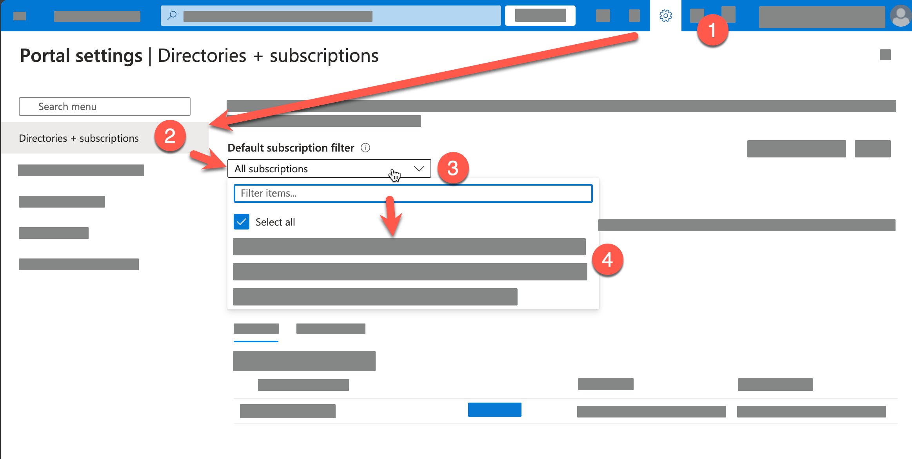
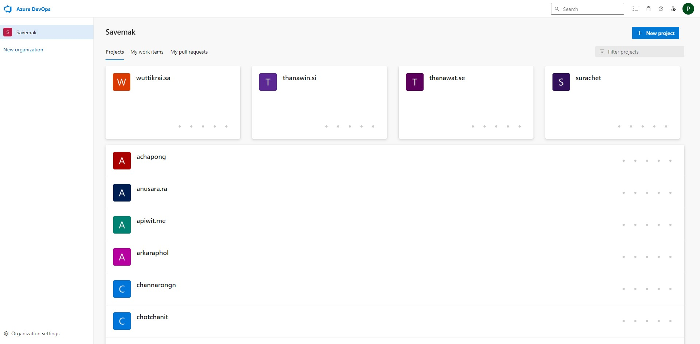

# Exploring Azure Service

- [Exercise Instruction](./Exercises/README.md)
- [Lab files](./Allfiles/Labs/)

## 0. Validating your lab resources

### 1. Azure Account
   - You should have an active Azure account, prepared by your lab host. 
   - Check your email for invitation to join the Azure subscription.
   - Try to signin with the provided credentials at [https://portal.azure.com](https://portal.azure.com)
   - Check your subscription which provided by lab host
        

### 2. Azure DevOps Organization
   - You should have an active Azure DevOps organization, prepared by your lab host. 
   - Check your email for invitation to join the Azure DevOps organization.
   - Try to signin with the provided credentials at [https://aex.dev.azure.com](https://aex.dev.azure.com)
   - You should see the organization, try to find your project (which should be named after your name)
        
